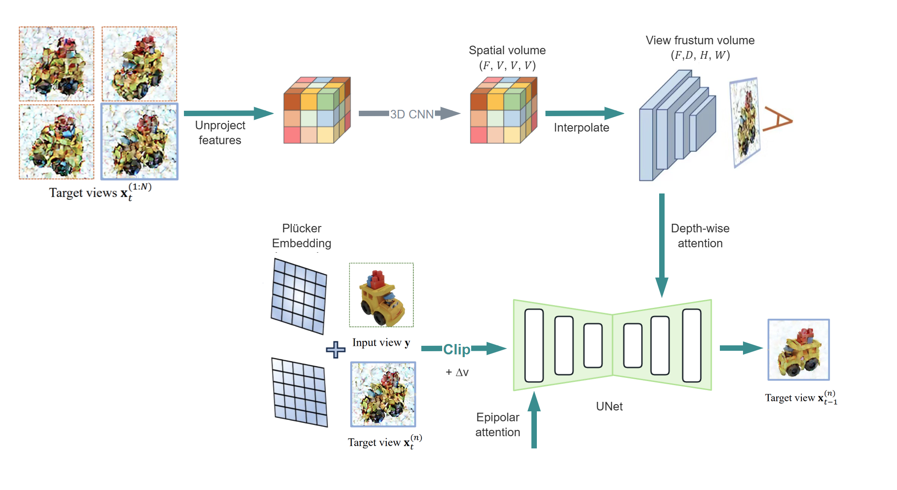
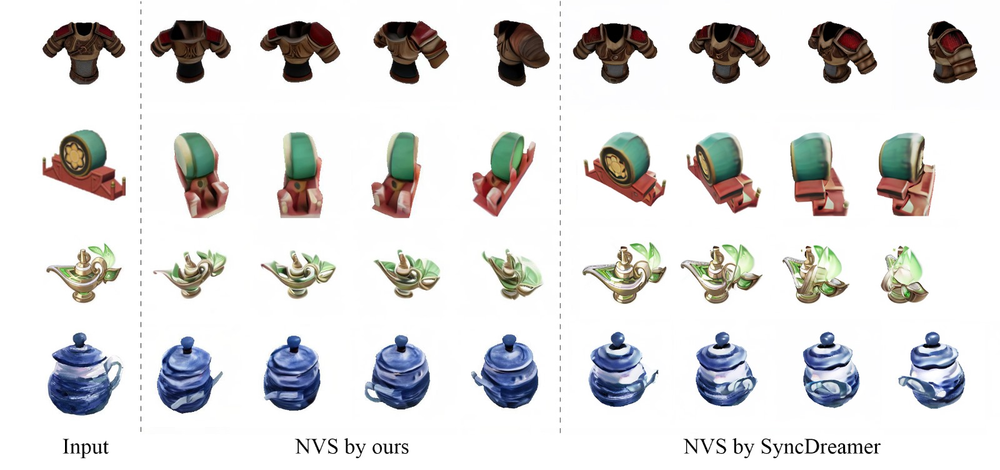
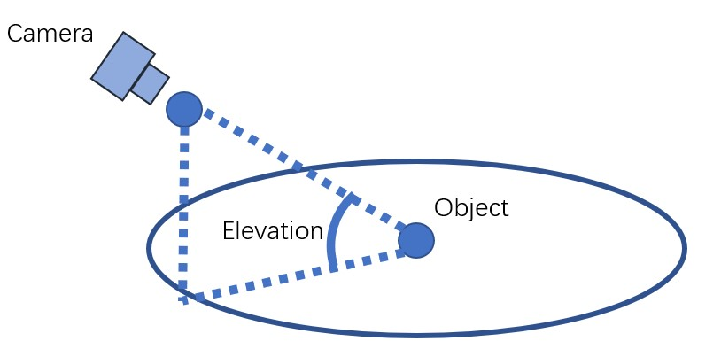
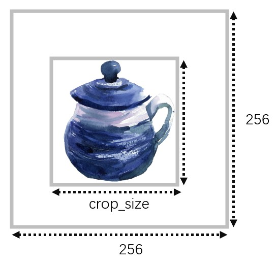

# MultiPose Fusion
MultiPose Fusion: Single-view 3D Reconstruction Using Diffusion Models with Flexible Camera Pose


===================================================
<h4>
Chuqi Zhang, Likeer Xu, Rouzbeh Amin Tafreshi, Ruiyi Lian



## Filtered High-Quality Objaverse
If you are looking for the objaverse assets we used to train model, you can find that list here: [filtered_objaverse.txt](https://github.com/Chuqi-Leo-Zhang/MultiPose-Fusion/blob/main/data/objaverse_filtered.txt)

To see how this list was generated / tweak its parameters, you can try this colab notebook here: [filter_objaverse.ipynb](https://colab.research.google.com/drive/1UJM4caaBJsYOkP7EmjPjBvoJ7U0qY4kq#scrollTo=sR28TydbQUuT)

We in total generated our data from 26k objects from the filtered objaverse. The object uids are saved here: [uid_set.pkl](https://github.com/Chuqi-Leo-Zhang/MultiPose-Fusion/blob/main/data/uid_set.pkl)

## Repository Setup 

1. Create a fresh conda environment and install packages in `requirements.txt`. We test our model on a 40G L40 GPU with 12.5 CUDA and 2.5.1 pytorch.
```angular2html
conda create -n posefusion python=3.9
conda activate posefusion
pip install -r requirements.txt

pip install git+https://github.com/NVlabs/tiny-cuda-nn/#subdirectory=bindings/torch
pip install git+https://github.com/openai/CLIP.git
pip install "git+https://github.com/facebookresearch/pytorch3d.git"

git clone git@github.com:CompVis/taming-transformers.git
cd taming-transformers && pip install -e . && cd ..
```

## Repository Structure
```bash
MultiPose-Fusion
...
|-- configs
|-- ldm
|-- raymarching
...
```
The most crucial folders for this repository is as above. In configs we put all our configurations for training & inference. In ldm it has all modified models w.r.t. the diffusion models. Raymarching is a package you need to install with:
```bash
cd raymarching & pip install .
```

## Inference
1. Make sure you have the following models.
```bash
MultiPose-Fusion
|-- ckpt
    |-- ViT-L-14.ckpt
    |-- posefusion-2k.ckpt
```

2. Run MultiPose-Fusion to produce multiview-consistent images.
```bash
python generate.py --ckpt finetune_checkpoint/syncdreamer-train/epoch=000023.ckpt \
                   --input testset/alarm.png \
                   --output output/alarm-50 \
                   --sample_num 4 \
                   --cfg_scale 2.0 \
                   --input_elevation 20 \
                   --target_elevation 50 \
                   --crop_size 200
```
Explanation:
- `--ckpt` is the checkpoint to load.
- `--input` is the input image in the RGBA form. The alpha value means the foreground object mask.
- `--output` is the output directory. Results would be saved to `output/aircraft/0.png` which contains 16 images of predefined viewpoints per `png` file. 
- `--sample_num` is the number of instances we will generate. `--sample_num 4` means we sample 4 instances from `output/aircraft/0.png` to `output/aircraft/3.png`.
- `--cfg_scale` is the *classifier-free-guidance*. `2.0` is OK for most cases. We may also try `1.5`.
- `--input_elevation` is the elevation angle of the input image in degree. As shown in the following figure,

- We assume the object is locating at the origin and the input image is captured by a camera with an elevation angle. Note we don't need a very accurate input elevation angle but a rough value in [-10,40] degree is OK, e.g. {0,10,20,30}.
- `--target_elevation` is the elevation angle of the target image in degree.
- `--crop_size` affects how we resize the object on the input image. The input image will be resize to 256\*256 and the object region is resized to `crop_size` as follows. `crop_size=-1` means we do not resize the object but only directly resize the input image to 256*256. 
`crop_size=200` works in most cases. We may also try `180` or `150`.
- 

3. Train the 3D reconstruction models to generate consistent novel views
```bash
python train_renderer.py -i output/alarm-50/0.png  \
                         -n aircraft-neus \
                         -b configs/neus.yaml \
                         -l output/renderer/baseline/alarm/50/ \
                         --elevation 50
```
Explanation:
- `-i` contains the multiview images generated by SyncDreamer. Since SyncDreamer does not always produce good results, we may need to select a good generated image set (from `0.png` to `3.png`) for reconstruction.
- `-n` means the name. `-l` means the log dir. Results will be saved to `<log_dir>/<name>` i.e. `output/renderer/aircraft-neus` and `output/renderer/aircraft-nerf`.
- Before training, we will run `carvekit` to find the foreground mask in `_init_dataset()` in `renderer/renderer.py`. The resulted masked images locate at `output/renderer/aircraft-nerf/masked-*.png`. Sometimes, `carvekit` may produce incorrect masks.
- A rendering video will be saved at `output/renderer/aircraft-neus/rendering.mp4` or `output/renderer/aircraft-nerf/rendering.mp4`.
- We will only save a mesh for NeuS but not for NeRF, which is `output/renderer/aircraft-neus/mesh.ply`.

## Acknowledgement

We have intensively borrow codes from the following repositories. Many thanks to the authors for sharing their codes.

- [SyncDreamer](https://github.com/liuyuan-pal/SyncDreamer)
- [SPAD](https://github.com/yashkant/spad)

